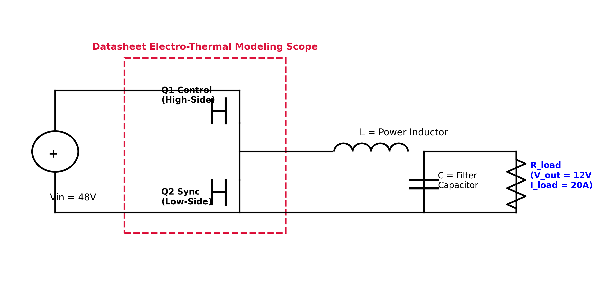
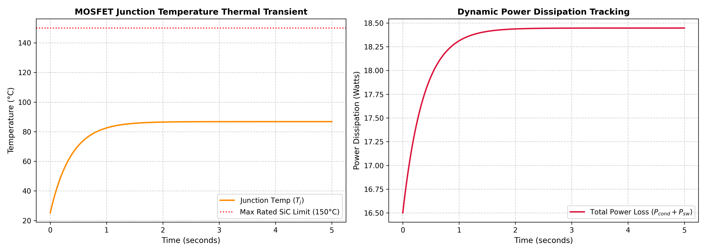

# Synchronous Buck Converter with Datasheet-Based Thermal Modeling

## 📌 Project Overview
This repository features a dynamic electro-thermal simulation engine written entirely in Python. While conventional power electronics simulations treat semiconductors as ideal switches with static parameters, real-world devices experience losses that dissipate as heat. This temperature rise changes the semiconductor's internal properties, creating a non-linear behavior that alters efficiency over time.

To accurately track this phenomenon, this project implements a dynamic feedback loop that calculates transient switching and conduction losses using extracted datasheet parameters modeled after a high-performance **Silicon Carbide (SiC) Power MOSFET**. The simulation handles these temperature-dependent variables iteratively to evaluate stability and avoid thermal runaway conditions under a continuous load.

---

## 📊 Electro-Thermal Design Specifications

### 1. Power Stage Variables
| Operating Parameter | Symbol | Target Value |
| :--- | :--- | :--- |
| **Input Bus Voltage** | $V_{in}$ | 48.0 V |
| **Output Voltage** | $V_{out}$ | 12.0 V |
| **Continuous Load Current** | $I_{load}$ | 20.0 A |
| **Target Switching Frequency** | $f_{sw}$ | 100 kHz |
| **Calculated Duty Cycle** | $D$ | 0.25 (25%) |

### 2. Semiconductor & Case Parameters
| Silicon Characterization Parameter | Symbol | Value |
| :--- | :--- | :--- |
| **Baseline On-Resistance (25°C)** | $R_{ds(on)25}$ | 0.045 $\Omega$ |
| **On-Resistance Temp Coefficient** | $\alpha_T$ | 0.007 per °C |
| **Turn-On Energy Characteristic** | $E_{on}$ | 80 $\mu$J |
| **Turn-Off Energy Characteristic** | $E_{off}$ | 40 $\mu$J |
| **Junction-to-Case Resistance** | $R_{th\_jc}$ | 0.85 °C/W |
| **Case-to-Ambient Heatsink Resistance**| $R_{th\_ca}$ | 2.50 °C/W |

---

## ⚡ Synchronous Power Stage Layout
Unlike a conventional buck converter that relies on a freewheeling diode, this synchronous topology replaces the diode with a low-side MOSFET switch ($Q_2$). This drastically minimizes conduction drops across the lower quadrant, shifting the primary thermal stress points based on operational duty parameters.

---

## 📈 Thermal Evaluation & Simulation Analysis

### 1. The Electro-Thermal Loop Physics
The simulation tracks the interactive dependencies between hardware efficiency and heating vectors recursively at a millisecond time step ($\Delta t = 1\text{ ms}$):

$$\text{Losses} \longrightarrow \Delta T_j \longrightarrow R_{ds(on)\text{ increase}} \longrightarrow \text{Compounded Losses}$$

* **Conduction Losses ($P_{cond}$):** Modeled dynamically through instantaneous current saturation distributions across the duty period:
  $$P_{cond} = I_{load}^2 \cdot R_{ds(on)\text{dynamic}} \cdot D$$
* **Switching Losses ($P_{sw}$):** Calculated continuously by adjusting benchmark datasheet evaluation profiles against current operational bus voltage and load configurations:
  $$P_{sw} = (E_{on} + E_{off}) \cdot f_{sw} \cdot \left(\frac{V_{in}}{V_{test}}\right) \cdot \left(\frac{I_{load}}{I_{test}}\right)$$

### 2. Transient Response Verification
The dual plotting metrics track the thermal trajectory of the high-side switch during continuous operational strain. 

The heat curve showcases an authentic exponential rise before reaching absolute thermal equilibrium at **86.80°C**, which sits safely within standard industrial safe operating boundaries (well below the 150°C maximum limit). The corresponding loss progression showcases the impact of internal resistance drift—compounding baseline losses from 16.5 W up to a steady state total of **18.45 W**.

---

## 🚀 Key Engineering Skills Demonstrated
* **Electro-Thermal Systems Integration:** Mathematical modeling of semiconductor junction heat flow via equivalent lumped RC thermal network parameters.
* **Datasheet Interpretation:** Translating manufacturer semiconductor loss parameters ($E_{on}$, $E_{off}$, thermal coefficients) into scalable programmatic behavioral profiles.
* **Dynamic Simulation Design:** Creating recursive numerical solvers to process intersecting physical variables without relying on commercial software packages.
